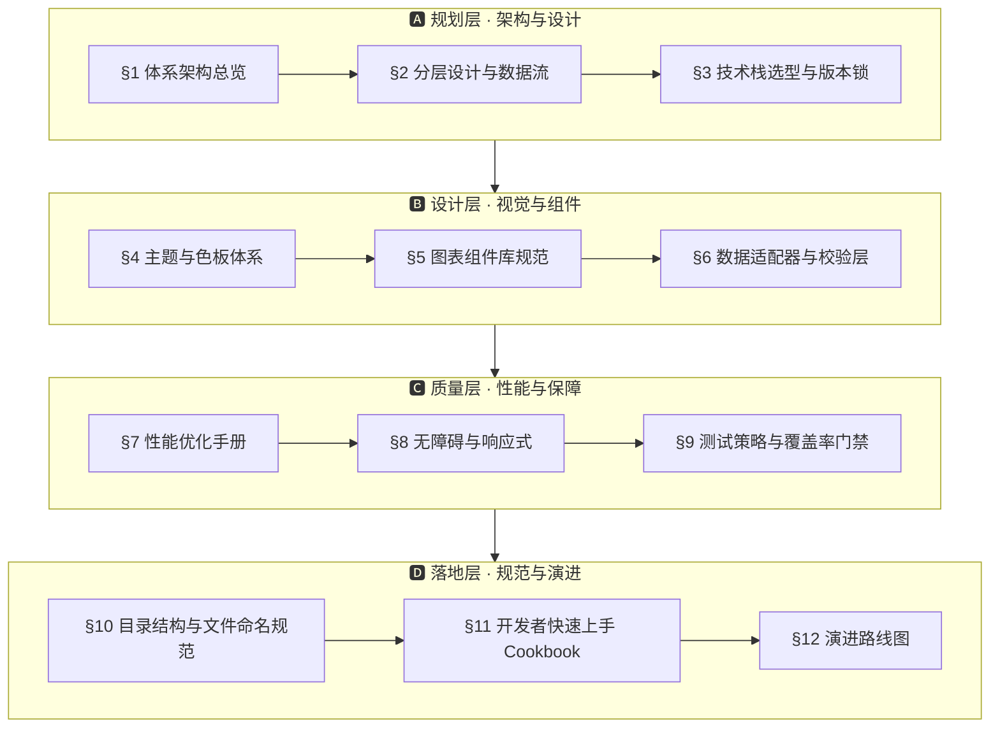

<!--
  file: README.md
  description: YYC³ Family IDE Matrix · 可视化体系设计开发者文档
  author: YanYuCloudCube Team <admin@0379.email>
  version: v1.1.0
  created: 2026-08-19
  updated: 2026-08-20
  status: active
  tags: [docs,visualization,architecture,spec]
-->

<p align="center">
  
</p>

<h1 align="center">YYC³ Family IDE Matrix · 可视化体系设计开发者文档</h1>

<div align="center">

> ***YanYuCloudCube*** · 言启象限 · 语枢未来
>
> **设计哲学**：以「深蓝 + 青色赛博朋克」为视觉基因，以「数据洞察 → 快速决策」为目标，
> 构建**高信息密度、低认知负担、强交互反馈**的智能可视化系统。

</div>

---

## 🏷️ 徽章系统

<div align="center">

**工程状态**

[](https://github.com/YYC-Cube/YYC3-Family-IDE-Matrix/actions/workflows/ide-test-coverage.yml)
[](https://github.com/YYC-Cube/YYC3-Family-IDE-Matrix)
[](https://github.com/YYC-Cube/YYC3-Family-IDE-Matrix)
[](ide/package.json)
[](ide/package.json)
[](ide/package.json)
[](ide/package.json)
[](.github/workflows/ide-test-coverage.yml)

**核心技术栈**

[](https://react.dev/)
[](https://www.typescriptlang.org/)
[](https://vitejs.dev/)
[](https://recharts.org/)
[](https://zod.dev/)
[](https://github.com/pmndrs/zustand)
[](https://www.radix-ui.com/)
[](https://tailwindcss.com/)
[](https://vitest.dev/)
[](https://www.framer.com/motion/)

</div>

---

## 🗺️ 文档架构

本文档按「**规划 → 设计 → 质量 → 落地**」四层组织 12 个章节，形成一套可落地、可验证、可演进的可视化体系规范。

### 分层全景图



### 章节索引

| 章节 | 主题 | 目标读者 |
| ------ | ------ | ---------- |
| [§1 体系架构总览](#1-体系架构总览) | 五维组合 · 五高 × 五维目标矩阵 | 全体 |
| [§2 分层设计与数据流](#2-分层设计与数据流) | 单向管线 · 组件依赖方向 | 前端架构师 |
| [§3 技术栈选型与版本锁](#3-技术栈选型与版本锁) | 依赖基线 · 重型库黑名单 | DevOps / 技术负责人 |
| [§4 主题与色板体系](#4-主题与色板体系-cyberpunk-基因) | Design Tokens · 色板使用铁律 | 设计师 / 前端 |
| [§5 图表组件库规范](#5-图表组件库规范) | 统一 API 契约 · 组件清单 | 前端工程师 |
| [§6 数据适配器与校验层](#6-数据适配器与校验层) | Zod Schema · useChartData Hook | 全栈工程师 |
| [§7 性能优化手册](#7-性能优化手册) | LTTB 降采样 · 渲染优化清单 | 高级前端 |
| [§8 无障碍与响应式](#8-无障碍-a11y-与响应式) | a11y 三项铁律 · 响应式断点 | 高级前端 |
| [§9 测试策略与覆盖率门禁](#9-测试策略与覆盖率门禁) | 测试金字塔 · 必测清单 | QA / 前端 |
| [§10 目录结构与文件命名规范](#10-目录结构与文件命名规范) | 目录约定 · 命名铁律 | 全体 |
| [§11 开发者快速上手 Cookbook](#11-开发者快速上手-cookbook) | 场景化示例 · 上手捷径 | 新成员 |
| [§12 演进路线图](#12-演进路线图) | M1→M5 里程碑 | 技术负责人 |

---

## 📌 项目简介

**YYC³ Family IDE Matrix** 是 YanYuCloudCube 家族智能应用矩阵的**可视化体系设计规范**，覆盖从数据接入、图表渲染到性能治理与测试门禁的**全链路设计标准**。本文档既是**开发者规范**，也是**架构决策记录 (ADR)**，确保任何开发者与 AI 协同对象都能按同一契约构建智能可视化能力。

### 核心能力

| 能力 | 说明 |
| ------ | ------ |
| **五高保障** | 高可用 · 高性能 · 高安全 · 高扩展 · 高智能 |
| **五维评估** | 时间 · 空间 · 属性 · 事件 · 关联 全维度审视 |
| **统一契约** | 图表组件单一 Props 契约 + Zod 运行时校验 |
| **主题基因** | Cyberpunk-88 深蓝 + 青色 Design Tokens，可插拔 |
| **性能治理** | LTTB 降采样 / React.memo / 懒加载 分级策略 |
| **质量门禁** | 覆盖率阈值写入 `vitest.config.ts` + CI 阻断合并 |

### 目标读者

架构师 / 前端工程师 / 全栈工程师 / QA / DevOps / 新成员。

---

## 🚀 快速开始

```bash
# 1. 安装依赖（pnpm ≥ 8）
cd ide
pnpm install

# 2. 启动开发服务器（端口 3030 起 🚨）
pnpm dev

# 3. 运行测试 & 覆盖率（与 CI 门禁 100% 一致）
pnpm test
pnpm test:coverage

# 4. 类型检查 / Lint
pnpm exec tsc --noEmit
pnpm lint
```

> 环境要求：Node.js ≥ 18 · pnpm ≥ 8 · 包管理器锁定 `pnpm@9.0.0`（见 [`ide/package.json`](ide/package.json)）。

---

## 📦 仓库结构

```
YYC3-Family-IDE-Matrix/
├── README.md                     # ← 本文档 · 可视化体系设计规范
├── public/
│   ├── yyc3-family.png           # 品牌顶图
│   └── yyc3/                     # 各平台应用图标 (Android/iOS/macOS/watchOS/Web)
├── ide/                          # @yyc3/ide 工作台工程
│   ├── package.json              # 依赖基线 & 版本锁
│   ├── components/
│   │   └── visualization/        # 可视化体系实现（主题/图表/校验/适配）
│   │       └── README.md         # 组件库快速参考
│   ├── services/agent/           # Agent 技能/蓝图/LLM 服务
│   ├── lib/snapshot/             # 快照 Diff 引擎
│   ├── stores/                   # Zustand 状态管理
│   └── docs/                     # IDE 开发运维拓展指南
└── .github/workflows/
    └── ide-test-coverage.yml     # CI 测试 & 覆盖率门禁
```

---

## §1 体系架构总览

### 1.1 什么是 YYC³ 可视化体系

YYC³ 可视化体系 = **主题引擎** + **图表组件库** + **数据适配层** + **交互反馈层** + **可观测层** 的五维组合。
它不是一套 Recharts 组件的零散封装，而是一个**可组合、可拓展、可观测**的子系统。

```
┌──────────────────────────────────────────────────────────────────┐
│  YYC³ 可视化体系架构 (四层洋葱模型)                                │
├──────────────────────────────────────────────────────────────────┤
│                                                                  │
│   Layer 4 · 业务面板层 (Dashboards)                              │
│   ┌─────────────────────────────────────────────────────────┐    │
│   │  ModelPerfPanel | SnapshotDiffPanel | AgentMonitor | ...│    │
│   └─────────────────────────────────────────────────────────┘    │
│         │ 拼装 & 传参                                            │
│   Layer 3 · 图表组件层 (Chart Components)                        │
│   ┌────────────┬──────────────┬────────────┬───────────────┐    │
│   │ LineChart  │ AreaChart    │ BarChart   │ Pie/Donut     │    │
│   │ Heatmap    │ Radial/Spider│ Gauge      │ Timeline      │    │
│   └────────────┴──────────────┴────────────┴───────────────┘    │
│         │ Tooltips / Legends / Brushes (统一 HOC 包装)           │
│   Layer 2 · 交互 & 主题基础层 (Foundation)                      │
│   ┌─────────────────┬──────────────────────────────────────┐     │
│   │ ThemeProvider   │ ChartPrimitives (X/Y 轴/网格)        │     │
│   │ ResponsiveWrap  │ Accessibility Wrapper                │     │
│   └─────────────────┴──────────────────────────────────────┘     │
│         │ 数据契约 (useChartData hook)                           │
│   Layer 1 · 数据适配层 (Data Adapters + Validators)             │
│   ┌────────────────────┬──────────────────┬─────────────────┐    │
│   │ API/Store → Chart │ Schema 校验(Zod) │ 空/异常/降级    │    │
│   │ 字段标准化        │ 类型守卫          │ 骨架屏占位      │    │
│   └────────────────────┴──────────────────┴─────────────────┘    │
│                                                                  │
└──────────────────────────────────────────────────────────────────┘
```

### 1.2 设计目标矩阵 (五高 × 五维)

| 五高指标 | 在可视化层的体现 | 测量方式 |
| ---------- | ----------------- | ---------- |
| **高可用** | 任意异常输入不崩溃；空值/错误/超时降级占位齐备 | 单测覆盖率 ≥ 95% |
| **高性能** | 1w 点折线 ≤ 60fps；30 条 series 不卡顿 | Chrome Performance Profiler |
| **高安全** | 展示内容 XSS 过滤；数据来源验证；Tooltip 防注入 | CSP + 代码审计 |
| **高扩展** | 新增图表类型无需改核心；可插拔配色/交互 | Cookbook 新增案例 < 50 行 |
| **高智能** | 自动推荐图表类型；异常值高亮；AI 洞察旁白 | 决策树 + 阈值规则 |

---

## §2 分层设计与数据流

### 2.1 数据流单向管线 (Pipeline)

```
┌─────────────┐    ┌──────────────────┐    ┌──────────────────┐    ┌──────────┐
│  数据来源    │ →  │ normalize()       │ →  │  validate()      │ →  │ 渲染    │
│  API/Store  │    │ 字段标准化/时间戳 │    │ Zod 契约校验     │    │ 图表组件 │
└─────────────┘    └──────────────────┘    └──────────────────┘    └──────────┘
   │                  │ 失败时                │ 失败时                │ ↑
   ↓                  ↓                       ↓                       │ useChartData() hook
┌─────────────┐    ┌──────────────────┐    ┌──────────────────┐     └── 错误边界
│  缓存/重试  │    │ 空值骨架屏        │    │ 错误降级(老数据) │         ErrorBoundary
└─────────────┘    └──────────────────┘    └──────────────────┘
```

**三个重要原则**：

1. **数据永远在进入图表前标准化** — 不要在 LineChart/AreaChart 内做 `item.latency || 0`
2. **校验失败不抛异常，转 fallback 渲染** — 空骨架 / 历史快照 / N/A 卡
3. **渲染函数是纯函数** — 相同输入必然相同输出，便于 snapshot testing 和缓存

### 2.2 组件分类与依赖方向

```
components/visualization/
  ├── primitives/         ← 零依赖 (只依赖 recharts + 主题)
  │   ├── ChartAxis.tsx
  │   ├── ChartGrid.tsx
  │   ├── Gradient.ts
  │   └── TooltipShell.tsx
  ├── charts/             ← 依赖 primitives + theme
  │   ├── LineChart.tsx
  │   ├── AreaChart.tsx
  │   ├── BarChart.tsx
  │   ├── DonutChart.tsx
  │   ├── HeatmapChart.tsx
  │   ├── GaugeChart.tsx
  │   └── TimelineChart.tsx
  ├── composition/        ← 组合 HOC (依赖 charts)
  │   ├── withBrush.tsx
  │   ├── withLegend.tsx
  │   └── withAIInsight.tsx
  ├── panels/             ← 业务面板 (依赖 charts + adapters)
  │   ├── ModelPerfPanel.tsx
  │   ├── AgentFlowPanel.tsx
  │   └── ResourcePanel.tsx
  ├── theme/              ← 主题引擎 (零依赖)
  │   ├── VisualThemeProvider.tsx
  │   └── tokens.ts
  ├── hooks/              ← 组合 hooks (依赖 adapters)
  │   └── useChartData.ts
  ├── adapters/           ← 数据适配 (依赖 types + zod)
  │   └── perf.adapter.ts
  ├── validators/         ← zod schemas (零依赖)
  │   └── chart.schemas.ts
  └── types/              ← 类型定义 (零依赖)
      └── index.ts
```

**依赖禁止反向引用**：

- ✅ `panels/` → `charts/` → `primitives/`
- ❌ `primitives/` → `charts/` (绝对禁止)

---

## §3 技术栈选型与版本锁

### 3.1 主技术栈 (v1 基线)

| 领域 | 库 | 版本 | 选型理由 | 替换风险 |
| ------ | ---- | ------ | ---------- | ---------- |
| 主图表引擎 | `recharts` | `^2.12.7` | 生态成熟、React 原生、动画支持好 | 低 |
| 辅助小图 | `recharts` 原生 PieCell、ReferenceLine | — | 同引擎零耦合 | — |
| 大型热力 / 矩阵 | `recharts` Heatmap (或自定义 SVG) | — | 保持一致的色板体系 | 低 |
| 大数据 (>1w 点) 折线 | 降级 + 采样 | — | §7 详述 | — |
| 主题引擎 | React Context + CSS Variables | — | 零依赖 Dark/Light 切换 | 极低 |
| 图标 | `lucide-react` | `^0.441.0` | 线性风格统一 | 低 |
| 动画 | `framer-motion` | `^11.5.4` | 进入/退出/骨架屏 | 中 (可改为 CSS) |
| 数据校验 | `zod` | `^3.23.8` | 运行时 + TS 类型同时满足 | 低 |
| 响应式容器 | recharts `ResponsiveContainer` | — | 随父容器自适应 | 低 |

### 3.2 版本锁定规则

```jsonc
// package.json 中可视化依赖都要写死次版本号
{
  "dependencies": {
    "recharts": "~2.12.7",    // ~ 锁定次版本，防止大版本 break
    "zod": "~3.23.8"
  }
}
```

### 3.3 禁止引入的重型库 (黑名单)

| 库 | 禁止理由 | 推荐替代 |
| ---- | ---------- | ---------- |
| `echarts` (整个包) | 900KB+ 体积过大 | 只在 EChartsWrapper 中异步 lazy import |
| `antv/g2` | 生态不兼容 React 现有组件体系 | recharts + 自研 SVG |
| `d3` (整包) | API 函数式过重 | 仅按需引入 `d3-scale`, `d3-array` 等单函数模块 |

---

## §4 主题与色板体系 (Cyberpunk 基因)

### 4.1 设计令牌 (Design Tokens)

> 文件路径：`ide/components/visualization/theme/tokens.ts`

```typescript
/**
 * YYC³ 可视化主题令牌 v1
 * 风格: 深蓝 + 青色 · 赛博朋克 (Cyberpunk-88)
 * 参考色: LatencyTrendChart.tsx 现状保持一致
 */
export const VISUAL_TOKENS = {
  // —— 画布底色 ——
  canvas: {
    bg: "#0d1117",                // 主色（LatencyTrendChart 当前用）
    bgElevated: "#0d1117",
    panel: "rgba(255,255,255,0.02)",
    border: "rgba(255,255,255,0.06)",
  },
  // —— 文本色 ——
  text: {
    primary: "rgba(255,255,255,0.85)",
    secondary: "rgba(255,255,255,0.45)",
    tertiary: "rgba(255,255,255,0.20)",
    disabled: "rgba(255,255,255,0.10)",
  },
  // —— 主色: Cyan 家族 (言启·青色) ——
  primary: {
    50:  "#ecfeff",
    100: "#cffafe",
    200: "#a5f3fc",
    300: "#67e8f9",
    400: "#22d3ee",
    500: "#06b6d4",  // ← 主色 (LatencyTrendChart 用)
    600: "#0891b2",
    700: "#0e7490",
  },
  // —— 语义色板 ——
  semantic: {
    success: "#10b981",   // 翠绿 (成功/在线)
    error:   "#ef4444",   // 红色 (失败/异常)
    warning: "#f59e0b",   // 琥珀 (警告)
    info:    "#3b82f6",   // 亮蓝 (信息)
    purple:  "#a855f7",   // 紫色 (Agent)
    pink:    "#ec4899",   // 粉色 (创意)
  },
  // —— 序列色 (最多 8 色对应 8 家族角色) ——
  familySeries: [
    "#06b6d4", // tianshu 天枢 — cyan
    "#3b82f6", // qianhang 千行 — blue
    "#8b5cf6", // wanwu 万物    — violet
    "#a855f7", // xianzhi 先知  — purple
    "#10b981", // bole 伯乐     — emerald
    "#f59e0b", // shouhu 守护   — amber
    "#ef4444", // zongshi 宗师  — red
    "#ec4899", // lingyun 灵韵  — pink
  ],
  // —— 梯度 (Gradient id 规范见 §5.4) ——
  gradients: {
    latencyArea: ["rgba(6,182,212,0.3)", "rgba(6,182,212,0.02)"],
    errorArea:   ["rgba(239,68,68,0.3)",  "rgba(239,68,68,0.02)"],
    successArea: ["rgba(16,185,129,0.3)", "rgba(16,185,129,0.02)"],
  },
  // —— 网格 & 坐标轴 ——
  grid: {
    stroke: "rgba(255,255,255,0.04)",
    dashArray: "3 3",
  },
  axis: {
    stroke: "rgba(255,255,255,0.06)",
    tickFont: "9px",
    tickColor: "rgba(255,255,255,0.15)",
  },
  // —— 尺寸令牌 ——
  size: {
    xs: 100,
    sm: 130,   // LatencyTrendChart 当前 130px
    md: 220,
    lg: 320,
    xl: 480,
  },
  // —— 半径 & 间距 ——
  spacing: {
    radius: 12,
    padding: 12,
    margin: { top: 4, right: 4, left: -20, bottom: 0 }, // 与 LatencyChart 一致
  },
  // —— 字体 ——
  font: {
    sans: `ui-sans-serif, system-ui, -apple-system, "SF Pro Text"`,
    mono: `ui-monospace, SFMono-Regular, Menlo, Consolas`,
  },
};
```

### 4.2 色板使用铁律

| 场景 | 必须使用 | 禁止使用 |
| ------ | ---------- | ---------- |
| 主趋势线 / 主要 series | `primary.500` (#06b6d4) | 艳绿色、黄色 |
| 错误值 / 异常点高亮 | `semantic.error` (#ef4444) | 紫色、蓝色 |
| 成功 / 正常状态 | `semantic.success` (#10b981) | 红色 |
| 多系列对比 | `familySeries` 顺序取色 | 随意挑选自定义颜色 |
| 画布底色 | `canvas.bg (#0d1117)` + `panel 2%` | 纯白/浅灰 (Cyberpunk 风格不允许) |
| 渐变面积 | `gradients.*` 预设 + `defs > linearGradient` | 写死 stop 颜色在组件内 |

### 4.3 主题切换 (Dark ↔ Light ↔ Cyberpunk)

**暂不启用 Light 模式**（Cyberpunk 品牌视觉 v1 阶段只支持 Dark），但架构预留：

```tsx
<VisualThemeProvider mode="cyberpunk-88">
  {children}
</VisualThemeProvider>
```

未来扩展：`mode` 增加 `"sunrise-soft"`（浅色）时，只需添加第二套 tokens，所有图表组件自动读取。

---

## §5 图表组件库规范

### 5.1 组件 API 统一契约

所有 `charts/*.tsx` 文件的 Props 必须满足以下字段契约：

```typescript
interface BaseChartProps {
  /** 图表数据（已通过 useChartData hook 标准化和校验） */
  data: Record<string, unknown>[];
  /** 数据宽度 key，必须在 data 对象中存在 */
  dataKey: string;
  /** 画布高度 (px)；宽度永远由 ResponsiveContainer 100% */
  height?: number;
  /** 图表主色 (取 tokens 中之一)，undefined 使用 primary.500 */
  color?: string;
  /** 是否显示 Tooltip，默认 true */
  showTooltip?: boolean;
  /** 是否显示 Legend，默认 false */
  showLegend?: boolean;
  /** Tooltip 标题格式化 */
  labelFormatter?: (label: any) => React.ReactNode;
  /** 数值格式化 (单位后缀、精度) */
  valueFormatter?: (value: any, name?: string) => [React.ReactNode, string?];
  /** 异常/降级数据标记 */
  emptyState?: React.ReactNode;
  /** 自定义 className (Tailwind) */
  className?: string;
  /** aria-label 无障碍 */
  ariaLabel?: string;
}
```

### 5.2 基础折线图示例 (开发参考)

```tsx
/**
 * @file components/visualization/charts/LineChart.tsx
 * @description 统一契约的折线图组件，带渐变、网格、Tooltip
 */
import React, { useMemo } from "react";
import {
  LineChart as ReLineChart,
  Line,
  XAxis, YAxis, CartesianGrid,
  Tooltip, ResponsiveContainer,
} from "recharts";
import { VISUAL_TOKENS } from "../theme/tokens";
import type { BaseChartProps } from "../types";
import { TooltipShell } from "../primitives/TooltipShell";

export function LineChart(props: BaseChartProps) {
  const {
    data, dataKey,
    height = VISUAL_TOKENS.size.md,
    color = VISUAL_TOKENS.primary[500],
    showTooltip = true, showLegend = false,
    labelFormatter, valueFormatter,
    emptyState, className = "", ariaLabel,
  } = props;

  const t = VISUAL_TOKENS;

  // 空值降级
  if (!data || data.length === 0) {
    return emptyState ?? (
      <div
        className={`rounded-xl border border-white/[0.06] bg-white/[0.02] p-4 flex items-center justify-center ${className}`}
        style={{ height }}
        aria-label={ariaLabel ?? "折线图暂无数据"}
        role="img"
      >
        <p className="text-[10px] text-white/20">暂无数据</p>
      </div>
    );
  }

  const customTooltip = useMemo(() => {
    return ({ active, payload, label }: any) => (
      <TooltipShell
        active={active}
        payload={payload}
        label={labelFormatter ? labelFormatter(label) : label}
        valueFormatter={valueFormatter}
      />
    );
  }, [labelFormatter, valueFormatter]);

  return (
    <div
      className={`rounded-xl border border-white/[0.06] bg-white/[0.02] p-3 ${className}`}
      role="region"
      aria-label={ariaLabel ?? `折线图，共 ${data.length} 条数据`}
    >
      <ResponsiveContainer width="100%" height={height}>
        <ReLineChart data={data} margin={t.spacing.margin}>
          <CartesianGrid strokeDasharray={t.grid.dashArray} stroke={t.grid.stroke} />
          <XAxis
            dataKey="time"
            tick={{ fill: t.axis.tickColor, fontSize: t.axis.tickFont }}
            axisLine={{ stroke: t.axis.stroke }}
            tickLine={false}
          />
          <YAxis
            tick={{ fill: t.axis.tickColor, fontSize: t.axis.tickFont }}
            axisLine={{ stroke: t.axis.stroke }}
            tickLine={false}
          />
          {showTooltip && <Tooltip content={customTooltip} />}
          <Line
            type="monotone"
            dataKey={dataKey}
            stroke={color}
            strokeWidth={1.5}
            dot={{ fill: color, r: 2, strokeWidth: 0 }}
            activeDot={{ r: 3, fill: color, stroke: t.canvas.bg, strokeWidth: 2 }}
            isAnimationActive={data.length <= 200} // >200 条关闭动画以提升性能
          />
        </ReLineChart>
      </ResponsiveContainer>
    </div>
  );
}
```

### 5.3 组件清单 v1

| 文件名 | 图表 | 使用场景 | 优先级 |
| -------- | ------ | ---------- | -------- |
| `LineChart.tsx` | 折线图 | 延迟趋势、token 消耗、时间序列 | P0 |
| `AreaChart.tsx` | 面积图 | 吞吐、算力使用率 (参考 LatencyTrendChart) | P0 |
| `BarChart.tsx` | 柱状图 | 对比不同模型延迟 | P0 |
| `DonutChart.tsx` | 环形图 | CPU/GPU/内存占比饼图 | P0 |
| `GaugeChart.tsx` | 仪表盘 | 温度、使用率单一指标 | P1 |
| `HeatmapChart.tsx` | 热力图 | Provider × 时间段延迟矩阵 | P1 |
| `SpiderChart.tsx` | 雷达图 | Agent 能力 6 维画像 | P1 |
| `TimelineChart.tsx` | 时间线 | orchestrate 多 Agent 执行阶段 | P2 |
| `SankeyChart.tsx` | 桑基图 | 任务流向分解 | P2 |

### 5.4 SVG Gradient ID 规范

同一页面存在多个同类图表时 **Gradient ID 冲突**是 Recharts 的常见 bug，必须用 **唯一 ID 生成器**：

```typescript
// utils/chartUtils.ts
let __gradientSeq = 0;
export function makeChartGradId(prefix = "grad"): string {
  __gradientSeq = (__gradientSeq + 1) % 1_000_000;
  return `${prefix}_${Date.now().toString(36)}_${__gradientSeq}`;
}
```

```tsx
// AreaChart 内使用
const gradId = useMemo(() => makeChartGradId("area"), [color]);
return (
  <defs>
    <linearGradient id={gradId} x1="0" y1="0" x2="0" y2="1">
      <stop offset="5%" stopColor={color} stopOpacity={0.3} />
      <stop offset="95%" stopColor={color} stopOpacity={0.02} />
    </linearGradient>
  </defs>
);
```

---

## §6 数据适配器与校验层

### 6.1 数据校验 Zod Schema

**任何未通过 zod 校验的数据，都不允许直接进入图表组件** — 避免 NPE 或 XSS。

```ts
// validators/chart.schemas.ts
import { z } from "zod";

/** 任何时序数据点必须满足的最小契约 */
export const TimeSeriesPointSchema = z.object({
  time: z.string().or(z.number()),            // X 轴: 时间字符串或时间戳
  name: z.string().max(32).optional(),         // Legend 名
  value: z.number().or(z.null().transform(() => 0)), // Y 轴值
  status: z.enum(["success", "error", "warn", "idle"]).optional(),
}).passthrough();                               // 允许额外字段

/** 柱状图数据点 */
export const BarPointSchema = z.object({
  label: z.string().max(64),
  value: z.number().min(0),
  color: z.string().regex(/^#[\da-fA-F]{3,8}$/).optional(),
});

export const LineChartDataSchema = z.array(TimeSeriesPointSchema);
export const BarChartDataSchema = z.array(BarPointSchema);
```

### 6.2 useChartData Hook (核心)

所有页面调用图表组件前，都过一遍：

```tsx
// hooks/useChartData.ts
import { useMemo } from "react";
import { ZodSchema, ZodError } from "zod";

interface UseChartDataResult<T> {
  ok: boolean;
  data: T[];
  error: ZodError | null;
  hasData: boolean;
}

export function useChartData<T = unknown>(
  raw: unknown,
  schema: ZodSchema<T[]>,
  options: { fallbackEmpty?: boolean } = { fallbackEmpty: true }
): UseChartDataResult<T> {
  return useMemo(() => {
    const parsed = schema.safeParse(raw);
    if (!parsed.success) {
      return {
        ok: false,
        data: options.fallbackEmpty ? [] : [],
        error: parsed.error,
        hasData: false,
      };
    }
    return {
      ok: true,
      data: parsed.data,
      error: null,
      hasData: parsed.data.length > 0,
    };
  }, [raw, schema]);
}
```

**页面用法**：

```tsx
const chart = useChartData(diagnostics, LineChartDataSchema);
if (!chart.ok) return <ValidationFallbackPanel errors={chart.error} />;
return <LineChart data={chart.data} dataKey="value" />;
```

### 6.3 适配器模式

接口字段不统一（如 `latencyMs` vs `latency` vs `ping`）时，用适配器函数在进入 hook 前转换：

```ts
// adapters/perf.adapter.ts
export function perfDataToLine(points: PerfPoint[]): LinePoint[] {
  return points
    .filter((p) => p?.latency != null && !Number.isNaN(p.latency))
    .map((p) => ({
      time: new Date(p.timestamp).toLocaleTimeString("zh-CN", { hour12: false }),
      value: Math.round(p.latency),
      status: p.success ? "success" : "error",
      name: p.modelName,
    }));
}
```

---

## §7 性能优化手册

### 7.1 性能分级与对应策略

| 数据规模 | 折线 | 柱状 | 热力 | 策略 |
| ---------- | ------ | ------ | ------ | ------ |
| ≤200 点 | 全量渲染 + 动画开 | 同左 | — | 默认模式 |
| 200~2000 点 | 动画关 (`isAnimationActive=false`) | 同左 | — | 中等模式 |
| 2000~10000 点 | **LTTB 降采样** → 400 个特征点 | 同左 | 降采样 | 大型模式 |
| >10000 点 | 虚拟化 + Canvas (或 WebGL) 备选 | 不推荐折线，改用聚合柱状 | Canvas Heatmap | 超大数据模式 |

### 7.2 LTTB 降采样算法 (Large Time-series to Box)

LTTB 是时序折线行业标准降采样，**准确率 >> 普通等间距抽样**：

```ts
// utils/lttb.ts
/**
 * LTTB 降采样：返回 lengthDown 个代表性点
 * 论文: http://skemman.is/stream/get/1946/15343/37285/3/SS_MSthesis.pdf
 */
export function lttbDownsample(data: { x: number; y: number }[], lengthDown: number) {
  if (data.length <= lengthDown) return data;
  const sampled: typeof data = [];
  sampled.push(data[0]);
  let bucketSize = (data.length - 2) / (lengthDown - 2);
  let a = 0;
  for (let i = 0; i < lengthDown - 2; i++) {
    // Average next bucket
    const startNext = Math.floor((i + 1) * bucketSize) + 1;
    const endNext = Math.min(Math.floor((i + 2) * bucketSize) + 1, data.length);
    let avgX = 0, avgY = 0, nextCount = endNext - startNext;
    for (let n = startNext; n < endNext; n++) {
      avgX += data[n].x; avgY += data[n].y;
    }
    avgX /= nextCount; avgY /= nextCount;
    // Current bucket candidates
    const currStart = Math.floor(i * bucketSize) + 1;
    const currEnd = Math.floor((i + 1) * bucketSize) + 1;
    const aX = data[a].x, aY = data[a].y;
    let maxArea = -1, nextA = currStart;
    for (let c = currStart; c < currEnd; c++) {
      const area = 0.5 * Math.abs(
        (aX - avgX) * (data[c].y - aY) - (aX - data[c].x) * (avgY - aY)
      );
      if (area > maxArea) { maxArea = area; nextA = c; }
    }
    sampled.push(data[nextA]);
    a = nextA;
  }
  sampled.push(data[data.length - 1]);
  return sampled;
}
```

### 7.3 React 渲染优化清单

| 优化点 | 实现方式 | 预期效果 |
| -------- | ---------- | ---------- |
| 数据 memo | `useChartData` 返回值已经 useMemo | 避免父渲染时重算 |
| 图表组件 memo | `export const LineChart = React.memo(LineChartImpl)` | 减少父组件重渲染联动 |
| 自定义 Tooltip memo | TooltipShell 用 React.memo | hover 不闪烁 |
| 关闭大数据时动画 | `isAnimationActive={data.length <= 200}` | >200 点省 60% 渲染时间 |
| 分区懒加载 | Dashboard 每个 Panel 独立 `React.lazy` | FCP 减少 30-50% |

### 7.4 内存泄漏

- `ResponsiveContainer` 的 ResizeObserver 在 unmount 时自动清理 ✓
- **自定义 useChartData 如果有订阅，必须返回 cleanup 函数**
- 禁止在 Tooltip 回调内 setState 引发无限重渲染

---

## §8 无障碍 (a11y) 与响应式

### 8.1 a11y 三项铁律

| # | 要求 | 实现方式 | 核查方法 |
| --- | ------ | ---------- | ---------- |
| 1 | 所有图表必须有 `role="region"` + `aria-label` | 见 §5.2 代码模板 | axe DevTools |
| 2 | Tooltip 键盘可达 (Focus tooltipContent) | Recharts `trigger="hover focus"` | Tab 遍历 |
| 3 | 颜色不单独传达语义 — 必须补充文本/形状 | 图例文本 + 数据点边框样式 | 色盲模拟器验证 |

### 8.2 响应式断点

使用 Tailwind 语义断点，图表高度按容器调整：

| 断点 | 容器策略 | 典型图表高度 |
| ------ | ---------- | -------------- |
| `<640px mobile` | 单列 | size.sm (130px) |
| `640-1024px tablet` | 双列 | size.md (220px) |
| `>1024px desktop` | 2~4 列 | size.lg (320px) |

**所有图表宽度一律 `ResponsiveContainer width="100%"`**，不要写死 px。

---

## §9 测试策略与覆盖率门禁

### 9.1 测试金字塔对应可视化模块

```
        /\            手工探索 (5%)    — Playwright 视觉回归 + 交互
       /  \
      /----\         集成测试 (25%)    — Render + 数据变化 + tooltip 出现
     /------\
    /--------\       单元测试 (70%)    — 快照 + zod + 适配器 + useChartData
```

### 9.2 必测清单

```ts
// 单测必覆盖项
describe("LineChart", () => {
  it("empty data renders emptyState without crash", () => {});          // 空值降级
  it("valid data renders ResponsiveContainer + SVG path", () => {});   // 渲染
  it("valueFormatter applies unit suffix in tooltip", () => {});       // 格式化
  it("color prop changes stroke color on line", () => {});              // 主题一致性
  it("props change triggers re-render via React.memo correctly", () => {});
});

describe("useChartData", () => {
  it("malformed data returns ok=false with ZodError", () => {});        // 校验
  it("null/undefined value falls back to 0 per schema transform", () => {});
});

describe("lttbDownsample", () => {
  it("input <= threshold returns original", () => {});
  it("output array length === lengthDown (including first/last)", () => {});
  it("keeps first and last data point (no endpoint drift)", () => {});
});
```

### 9.3 覆盖率阈值 (写入 vitest.config.ts)

```ts
thresholds: {
  "components/visualization/**/*.tsx": { statements: 90, branches: 80 },
  "components/visualization/hooks/**/*.ts": { statements: 95 },
  "components/visualization/adapters/**/*.ts": { statements: 95 },
  "components/visualization/utils/**/*.ts": { statements: 100 },
}
```

### 9.4 视觉回归 (推荐)

使用 Playwright screenshot comparison：

- 每个 `Chart` 组件 × 3 种状态：空/正常/数据异常
- CI 中 diff 像素 > 2% 自动发评论标记 PR

---

## §10 目录结构与文件命名规范

```
ide/components/visualization/              # 主目录
├── README.md                              # ← 本章节的快捷参考
├── types/
│   └── index.ts                           # BaseChartProps 等类型
├── theme/
│   ├── tokens.ts                          # §4 Design Tokens
│   └── VisualThemeProvider.tsx
├── primitives/
│   ├── ChartAxis.tsx
│   ├── ChartGrid.tsx
│   ├── Gradient.ts
│   └── TooltipShell.tsx
├── charts/                                 # P0/P1 图表组件
│   ├── LineChart.tsx
│   ├── AreaChart.tsx
│   ├── BarChart.tsx
│   ├── DonutChart.tsx
│   ├── GaugeChart.tsx
│   ├── HeatmapChart.tsx
│   ├── SpiderChart.tsx
│   └── TimelineChart.tsx
├── composition/                            # HOC 组合
│   ├── withBrush.tsx
│   ├── withLegend.tsx
│   └── withAIInsight.tsx
├── adapters/                               # 各领域数据适配
│   ├── perf.adapter.ts
│   └── agent.adapter.ts
├── validators/
│   └── chart.schemas.ts                   # zod schemas
├── hooks/
│   └── useChartData.ts
├── utils/
│   ├── chartUtils.ts                      # makeChartGradId 等
│   └── lttb.ts
├── panels/                                 # 业务面板
│   ├── ModelPerfPanel.tsx                 # 模型延迟趋势 (旧 LatencyTrendChart → 迁移)
│   ├── AgentFlowPanel.tsx
│   └── ResourcePanel.tsx
└── __tests__/
    ├── charts/
    │   ├── LineChart.test.tsx
    │   └── AreaChart.test.tsx
    ├── hooks/useChartData.test.ts
    ├── utils/lttb.test.ts
    └── visual/                             # Playwright 截图测试
        └── charts.spec.ts
```

### 文件命名铁律

| 对象 | 规则 | 示例 |
| ------ | ------ | ------ |
| 图表组件 | `{Xxx}Chart.tsx` (PascalCase) | `GaugeChart.tsx` |
| 面板组件 | `{Xxx}Panel.tsx` | `ModelPerfPanel.tsx` |
| 适配器 | `{domain}.adapter.ts` | `perf.adapter.ts` |
| 校验 schema | `{xxx}.schemas.ts` | `chart.schemas.ts` |
| Hooks | `use{Xxx}.ts` | `useChartData.ts` |
| 工具 | `{xxx}.ts` | `lttb.ts` |
| 测试 | `{源文件名}.test.ts/tsx` | `LineChart.test.tsx` |

---

## §11 开发者快速上手 Cookbook

### 场景 1：新建一个「Token 消耗趋势折线图」

Step 1 — 适配数据：

```ts
// adapters/token.adapter.ts
export function tokenUsageToLine(points: TokenUsage[]): LinePoint[] {
  return points.map(p => ({
    time: new Date(p.ts).toLocaleTimeString(),
    value: p.tokens,
    status: p.success ? "success" : "error",
    name: p.modelId,
  }));
}
```

Step 2 — 在面板里用：

```tsx
import { LineChart } from "../charts/LineChart";
import { useChartData } from "../hooks/useChartData";
import { LineChartDataSchema } from "../validators/chart.schemas";
import { tokenUsageToLine } from "../adapters/token.adapter";

function TokenUsagePanel({ raw }: { raw: TokenUsage[] }) {
  const chart = useChartData(tokenUsageToLine(raw), LineChartDataSchema);
  return (
    <LineChart
      data={chart.data}
      dataKey="value"
      height={220}
      valueFormatter={(v) => [`${v} tokens`, "Token 消耗"]}
      ariaLabel="Token 消耗趋势折线图"
    />
  );
}
```

### 场景 2：新增一个 `RadarChart` 组件

1. 复制 `LineChart.tsx` → 改名为 `RadarChart.tsx`
2. Props 保留 BaseChartProps（字段契约不变）
3. Recharts 把 `<Line>` 换成 `<RadarChart><Radar polarAxis /> ...`
4. 套用 `t.familySeries` 多色
5. 写 `RadarChart.test.tsx` 覆盖 5 个必测用例
6. 新增到 §5.3 组件清单文档

### 场景 3：切换为 Light 主题

1. 在 `theme/tokens.ts` 增加 `const SUNRISE_TOKENS: VisualTokensType = { ... }`
2. `VisualThemeProvider` 读取 `mode` prop 返回对应 tokens
3. 所有图表无需修改（读 Context 自动生效）

---

## §12 演进路线图

| 阶段 | 版本 | 里程碑 | 预期时间 |
| ------ | ------ | -------- | ---------- |
| **M1 基础** | v1.0 | tokens + 4 类 P0 图表 + useChartData + zod | 2026 Q3 |
| **M2 丰富** | v1.1 | 4 类 P1 图表 + Composition HOC + 数据采样 | 2026 Q3末 |
| **M3 智能** | v2.0 | AI Chart Suggester (给数据自动选图表) + 异常点高亮 | 2026 Q4 |
| **M4 增强** | v2.1 | Playwright 视觉回归 + Canvas/ECharts 大数据降级 | 2026 Q4末 |
| **M5 生态** | v3.0 | 插件市场自定义图表类型 + 主题商店 | 2027 Q1 |

---

## 📚 相关文档

| 文档 | 说明 | 位置 |
| ------ | ------ | ------ |
| 本文档 | 可视化体系设计规范（架构 / 主题 / 组件 / 性能 / 测试） | [`README.md`](README.md) |
| 可视化组件库参考 | 图表 / 主题 / 校验 组件快速参考 | [`ide/components/visualization/README.md`](ide/components/visualization/README.md) |
| IDE 开发运维拓展指南 | IDE 工程化、CI/CD、运维实践 | [`ide/docs/YYC3-IDE-开发运维拓展指南.md`](ide/docs/YYC3-IDE-开发运维拓展指南.md) |
| CI 测试覆盖率门禁 | GitHub Actions 工作流定义 | [`.github/workflows/ide-test-coverage.yml`](.github/workflows/ide-test-coverage.yml) |

---

## 📝 变更历史

| 版本 | 日期 | 变更内容 | 作者 |
|------|------|----------|------|
| v1.1.0 | 2026-08-20 | 完善 README：新增品牌顶图、徽章系统、文档架构可视化、项目概览与快速开始 | YanYuCloudCube Team |
| v1.0.0 | 2026-08-19 | 初始版本：架构、主题令牌、组件规范、适配层、性能优化、测试、Cookbook | YanYuCloudCube Team |

---

<div align="center">

> 「***YanYuCloudCube***」
> 「***<admin@0379.email>***」
> 「***Words Initiate Quadrants, Language Serves as Core for Future***」
> 「***All things converge in cloud pivot; Deep stacks ignite a new era of intelligence***」

</div>

---

<div align="center">

*© 2025-2026 YanYuCloudCube™ · YYC³ Family IDE Matrix · All Rights Reserved.*

</div>
