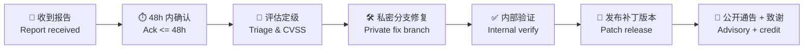

<!--
  file: SECURITY.md
  description: YYC³ Family IDE Matrix · 安全策略与漏洞报告流程
  author: YanYuCloudCube Team <admin@0379.email>
  version: v1.0.0
  created: 2026-09-16
  updated: 2026-09-16
  status: active
  tags: [security,policy,vulnerability]
-->

# 安全策略 | Security Policy

> **报告漏洞 | Report a Vulnerability**: 使用 [GitHub 私密安全通告](https://github.com/YYC-Cube/YYC3-Family-IDE-Matrix/security/advisories/new) 或邮件 **sec@0379.email**
> **公开渠道 | Public channel**: 请勿在 Issue / PR / Discussions 中披露未修复的漏洞。
> Do not disclose unfixed vulnerabilities in public issues.

---

## 支持版本 | Supported Versions

| 版本 Version | 支持状态 Status | 安全补丁 Security Fixes |
| --- | --- | :---: |
| `main` / 最新 Release（v3.x） | ✅ Full | ✅ |
| 前 1 个 minor（v2.x） | ✅ Maintenance | ✅ |
| 更早版本 Earlier（v1.x） | ❌ EOL | ❌ |

---

## 报告内容 | What to Include

1. 漏洞类型与影响面 Vulnerability type & impact scope（如 XSS / 密钥泄漏 / 沙箱逃逸 / CSRF / 供应链）
2. 复现步骤（含最小 PoC，请脱敏）Reproduction steps (minimal, sanitized PoC)
3. 受影响版本或提交 SHA Affected version / commit SHA
4. 影响组件（见 [`docs/LABELS.md`](docs/LABELS.md) 模块标签）Affected module
5. 修复建议（如有）Suggested fix, if any

---

## 响应流程 | Response Process

| 阶段 Stage | 目标时限 Target SLA |
| --- | --- |
| 确认收到 Acknowledgement | ≤ 48 小时 hours |
| 初步评估 Initial assessment | ≤ 7 天 days |
| 高危修复 High-severity fix | ≤ 30 天 days |
| 公开通告 Public disclosure | 补丁发布后 90 天内 within 90 days after patch |

---

## 严重度处理 | Severity Handling

| CVSS | 处置 Handling |
| --- | --- |
| 9.0-10.0 Critical | 立即应急：冻结发布窗 + 热修 + 全员通告 Immediate hotfix, freeze release window |
| 7.0-8.9 High | 30 天内补丁；`pnpm audit --prod` 门禁直接阻断 CI Patch within 30d; CI gate blocks high/critical |
| 4.0-6.9 Medium | 下一例行版本修复 Next regular release |
| 0.1-3.9 Low | 积压清单 Backlog |

---

## 安全编码基线 | Secure Coding Baseline

本项目已落地的强制约束（详见 [`docs/developer-guide.md`](docs/developer-guide.md)）：

| 域 Domain | 约束 Constraint | 实现 Implementation |
| --- | --- | --- |
| 密钥 Key | 零硬编码；`VITE_` 变量视为**公开**，禁止放长期密钥 | `services/security/APIKeyVault.ts`（WebCrypto AES-GCM + PBKDF2 310K 口令派生，非导出 CryptoKey） |
| 输入 Input | 用户输入 / RAG 文档 / 工具响应三入口一律消毒 | `services/security/Sanitizer.ts`（DOMPurify 3.4） |
| 请求 Request | 状态变更请求需 CSRF 双提交校验（常数时间比较） | `services/security/CsrfProtection.ts` |
| 传输 Transport | 生产密钥由服务端代理注入，客户端不直连 Provider | `services/llm/proxyAdapter.ts`（代理优先 → 直发回退） |
| 终端 Terminal | 元字符过滤 → 白名单 → 配额 → 超时 → 供应商策略闸门 | `services/terminal/policy.ts`（审计双写：内存环形 + IndexedDB append-only） |
| 渲染 Render | 禁止未消毒的 `dangerouslySetInnerHTML`；CSP 头限制脚本源 | `ide/public/_headers` |
| 依赖 Dependency | lockfile 冻结安装（`--frozen-lockfile --ignore-scripts`） | CI + `ide/pnpm-lock.yaml` |
| 供应链 Supply-chain | Actions 全部以 commit SHA 固定；顶层 `permissions: contents: read` | [`.github/workflows/ide-test-coverage.yml`](.github/workflows/ide-test-coverage.yml) |
| 静态扫描 Static scan | CodeQL `security-extended,security-and-quality`（push / PR / 每周） | [`.github/workflows/codeql.yml`](.github/workflows/codeql.yml) |
| 依赖更新 Deps | Dependabot 每周 npm + Actions，安全更新自动分组 | [`.github/dependabot.yml`](.github/dependabot.yml) |

---

## 不在范围内 | Out of Scope

- 依赖库自身漏洞 — 请上报对应上游项目（本项目经 Dependabot / `pnpm audit` 跟踪）
- 需要物理接触设备或已失陷终端的攻击场景
- 自动化扫描器输出的、无实际影响证明的低危噪声报告
- 社会工程学与钓鱼（请直接联系 **sec@0379.email** 单独处理）

---

**© 2025-2026 YanYuCloudCube™** · YYC³ Family IDE Matrix

