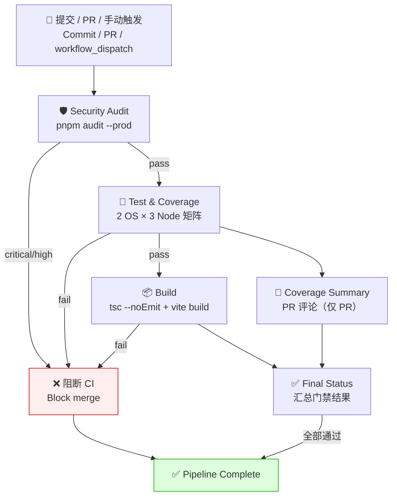

<!--
  file: docs/CICD.md
  description: CI/CD 流水线详解 — 触发/Job 链/门禁/告警/制品/本地等价命令
  author: YanYuCloudCube Team <admin@0379.email>
  version: v1.0.0
  created: 2026-09-16
  updated: 2026-09-16
  status: active
  tags: [ci,cd,github-actions,gate]
-->

# CI/CD 流水线详解 | CI/CD Pipeline Reference

> 工作流源码：[`.github/workflows/ide-test-coverage.yml`](../.github/workflows/ide-test-coverage.yml) · [`codeql.yml`](../.github/workflows/codeql.yml) · 依赖更新：[`dependabot.yml`](../.github/dependabot.yml)

---

## 一、全景流程图 | End-to-End Flow



**CodeQL 独立链路**：`push / pull_request / 每周一 00:00` → `security-extended,security-and-quality` 查询 → SARIF 上传 Security tab。

---

## 二、工作流矩阵 | Workflow Matrix

| 工作流 Workflow | 触发 Trigger | Job 链 Chain | 备注 Notes |
| --- | --- | --- | --- |
| `ide-test-coverage.yml` | `push` / `pull_request` → `main`/`master`（路径过滤 `ide/**`）· `workflow_dispatch` | `security-audit` → `test-and-coverage` → `build` → `coverage-summary` → `final-status` | 手动触发可指定单文件测试模式 |
| `codeql.yml` | `push` / `pull_request`（`ide/**`）· 每周一 cron | `analyze`（javascript-typescript） | 结果上传 GitHub Security tab |
| `dependabot.yml` | 定时（npm 每周一 09:00 Asia/Shanghai · Actions 每周） | PR 自动创建 | 安全更新分组，major 单独 PR |

**路径过滤说明**：CI 仅在 `ide/**` 或工作流文件本身变更时触发，文档 / 归档变更不会空跑流水线。
CI only runs when `ide/**` or the workflow file changes.

---

## 三、门禁标准 | Gate Standards

| 阶段 Stage | 工具 Tooling | 通过标准 Pass criteria |
| --- | --- | --- |
| 安全审计 Security audit | `pnpm audit --prod` | 生产依赖无 `critical` / `high` |
| 类型检查 Type check | `tsc --noEmit` | 0 errors |
| 单元测试 Unit test | Vitest（jsdom） | 全部用例通过（当前 1056 用例） |
| 覆盖率 Coverage | `@vitest/coverage-v8` | `services/agent/AgentSkills.ts` 专项 ≥ 90/95/85/90（语句/函数/分支/行） |
| 构建 Build | `tsc -b && vite build` | 产物生成成功（生产 sourcemap 关闭） |
| 静态安全 Static security | CodeQL | 无新增高置信度告警 |

> 覆盖率阈值统一定义在 [`ide/vitest.config.ts`](../ide/vitest.config.ts)，工作流不再重复一套；本地与 CI 数值 100% 一致。
> Thresholds live in `ide/vitest.config.ts` only — never duplicated in the workflow.

---

## 四、安全强化 | Supply-chain Hardening

| 措施 Measure | 说明 Detail |
| --- | --- |
| Actions 版本固定 | 所有 `uses:` 使用 **commit SHA**，禁止 `@v4` 浮动标签 |
| 最小权限 | 顶层 `permissions: contents: read`；仅覆盖率评论 job 提权 `pull-requests: write` |
| 输入不内插 | `workflow_dispatch` 输入经 `env` 传递，不直接拼进 bash |
| 冻结安装 | `pnpm install --frozen-lockfile --ignore-scripts` |
| 并发取消 | 同分支重复推送自动取消上一次运行（`concurrency.cancel-in-progress`） |
| 依赖审计 | Dependabot 每周扫描 + CI 生产依赖门禁 |

---

## 五、告警与通知 | Alerts

| 场景 Scenario | 通道 Channel |
| --- | --- |
| 任一 job 失败 | Actions 邮件通知 → <dev@0379.email> |
| 覆盖率评论 | PR 自动评论（Statements / Branches / Functions 三指标 + 阈值对比） |
| 安全高危 | CodeQL / Dependabot 建 Issue 并带 `security` 标签 → <sec@0379.email> |
| 发布失败 | 见 [`RELEASE.md`](RELEASE.md) |

---

## 六、分支保护策略建议 | Branch Protection (Recommended)

**`main`**
- Require pull request before merging + ≥ 1 approval
- Required status checks：`Security Audit` · `Test & Coverage` · `Build Production Bundle` · `Analyze (javascript-typescript)`
- Require linear history · Dismiss stale approvals · 禁止 force-push
- 限制直推：仅维护者可推送

**Tags `v*`**：仅维护者可创建（发布流程见 [`RELEASE.md`](RELEASE.md)）。

---

## 七、制品与保留 | Artifacts & Retention

| 制品 Artifact | 位置 Location | 保留 Retention |
| --- | --- | --- |
| 覆盖率报告 HTML/JSON | Actions Artifact（`coverage-node{X}-{os}-{run}`） | 30 天 days |
| 生产产物 `ide/dist` | Actions Artifact（`dist-{run}`） | 7 天 days |
| CodeQL SARIF | GitHub Security tab | 90 天 days（GitHub 策略） |
| 发布包 | GitHub Releases | 永久 forever |

---

## 八、本地等价命令 | Local Equivalents

```bash
cd ide

# 与 CI 完全同款的门禁链
pnpm install --frozen-lockfile --ignore-scripts   # 冻结安装
pnpm exec tsc --noEmit                            # 类型检查
pnpm test:coverage                                # 测试 + 覆盖率门禁
pnpm build                                        # 生产构建
pnpm audit --prod                                 # 生产依赖安全审计
pnpm lint                                         # ESLint
```

> 本地使用 `packageManager: pnpm@9.0.0`（corepack 自动对齐），确保「本地绿 = CI 绿」。
> The pinned pnpm version keeps local results identical to CI.

---

<div align="center">

**© 2025-2026 YanYuCloudCube™** · YYC³ Family IDE Matrix

</div>
