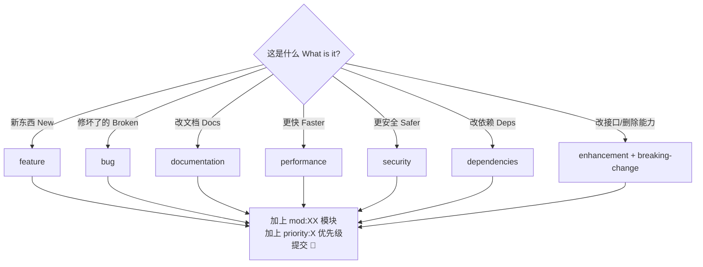

<!--
  file: docs/LABELS.md
  description: 标签规范详解 — 类型/优先级/状态/模块标签与使用规则
  author: YanYuCloudCube Team <admin@0379.email>
  version: v1.0.0
  created: 2026-09-16
  updated: 2026-09-16
  status: active
  tags: [labels,governance,issue,pr]
-->

# 标签规范详解 | Label Policy Reference

> 机器可读清单：[`.github/labels.json`](../.github/labels.json)（可用 [github-label-sync](https://github.com/Financial-Times/github-label-sync) 一键同步）
> 标签疑问 label questions: <dev@0379.email>

---

## 一、标签分类 | Taxonomy

### 1.1 类型标签 | Type Labels（主类型唯一 unique primary）

| Label | 颜色 Color | 中文 | English |
| --- | --- | --- | --- |
| `feature` | 🟩 `0E8A16` | 新功能 | New feature |
| `enhancement` | 🟦 `A2EEEF` | 功能增强 | Enhancement |
| `bug` | 🟥 `D73A4A` | 缺陷 | Defect / regression |
| `documentation` | 🟦 `0075CA` | 文档与规范 | Docs & standards |
| `performance` | 🟧 `FB9050` | 性能 | Performance |
| `security` | 🟥 `B60205` | 安全与合规 | Security & compliance |
| `ci` | 🟦 `1D76DB` | 流水线与构建 | Pipeline & build |
| `dependencies` | 🟦 `0366D6` | 依赖更新 | Dependency updates |
| `breaking-change` | 🟧 `D93F0B` | 破坏性变更 | Breaking change |

### 1.2 优先级 | Priority（恰好一个 exactly one）

| Label | 含义 | 响应目标 SLO |
| --- | --- | --- |
| `priority:critical` | P0 阻断生产 | 立即应急 immediate |
| `priority:high` | P1 当迭代处理 | 本迭代内 within sprint |
| `priority:medium` | P2 排期 | 2 个迭代内 within 2 sprints |
| `priority:low` | P3 积压 | 择期 backlog |

### 1.3 状态 | Status（仅维护者 maintainer-only）

`status:needs-triage` → `status:triaged` → `status:in-progress` → `status:needs-review` → ✅ 关闭 closed

旁路 bypass：`status:blocked` · `status:awaiting-feedback` · `status:duplicate` · `status:wontfix`

### 1.4 模块 | Module（≤ 3 个可叠加 stackable up to 3）

| Label | 覆盖范围 Scope |
| --- | --- |
| `mod:workbench` | `components/workbench/` 多文件编辑 |
| `mod:panel-host` | `components/panel-host/` 面板宿主 |
| `mod:agent` | `components/agent/` + `services/agent/` |
| `mod:terminal` | `components/terminal/` + `services/terminal/` |
| `mod:visualization` | `components/visualization/` |
| `mod:model-settings` | `components/model-settings/` + `APIKeyManagerPanel.tsx` |
| `mod:plugins` | `components/plugins/` + `services/plugins/` |
| `mod:snapshot` | `components/snapshot/` + `lib/snapshot/` |
| `mod:mcp` | `services/mcp/` |
| `mod:llm` | `services/llm/`（Provider / 降级 / 限流 / 代理适配） |
| `mod:context` | `llm/` 上下文工程 |
| `mod:security` | `services/security/` |
| `mod:storage` | `services/storage/` + `stores/` |
| `mod:collab` | `services/collab/` + `collab-server/` |
| `mod:electron` | `electron/` 桌面壳 |
| `mod:infra` | `.github/` · 构建与工程配置 |
| `mod:docs` | `README.md` · `docs/` |

### 1.5 社区 | Community

`good-first-issue` · `help-wanted` · `hacktoberfest`

---

## 二、使用规则 | Usage Rules

1. **Issue 必选**：1 类型 + 1 模块 + 1 优先级；模板会预置 `status:needs-triage`。
   Issue requires: type + module + priority; templates pre-set `status:needs-triage`.
2. **PR 必选**：1 类型 + 1 模块；标题遵循 Conventional Commits（见 [`../CONTRIBUTING.md`](../CONTRIBUTING.md)）。
   PR requires: type + module; title follows Conventional Commits.
3. **`breaking-change`**：必须叠加 `priority:critical` 或 `priority:high`，并在 PR 描述提供迁移说明。
   `breaking-change` requires a critical/high priority plus migration notes.
4. **状态标签**：仅维护者流转，贡献者请勿添加或修改。
   Status labels are maintainer-managed; contributors shall not alter them.
5. **单个 Issue 主类型唯一**；模块标签可叠加但 ≤ 3 个。
   One primary type per Issue; up to 3 module labels.

---

## 三、决策速查 | Quick Decision Tree

---

**© 2025-2026 YanYuCloudCube™** · YYC³ Family IDE Matrix

