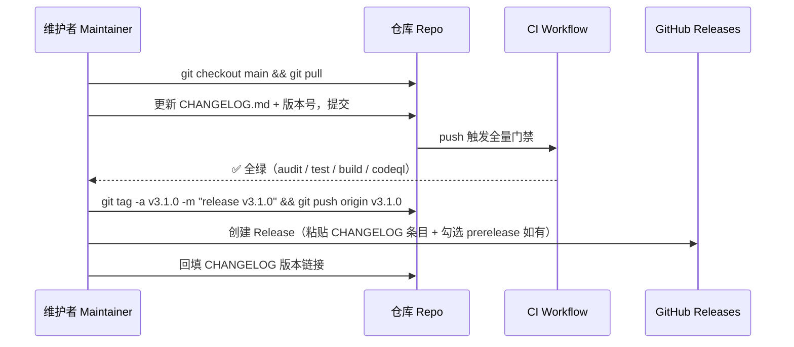

<!--
  file: docs/RELEASE.md
  description: 发布流程 — 语义化版本/前置检查单/发布步骤/发布后动作/回滚
  author: YanYuCloudCube Team <admin@0379.email>
  version: v1.0.0
  created: 2026-09-16
  updated: 2026-09-16
  status: active
  tags: [release,semver,versioning]
-->

# 发布流程 | Release Process

> 版本语义 SemVer 2.0.0 · 触发方式 tag-driven · 维护联系 <admin@0379.email>

---

## 一、版本语义 | Versioning Semantics

```text
v MAJOR . MINOR . PATCH
   │       │       └─ 缺陷修复 / 文档笔误 bug fixes, typos
   │       └─ 新功能 / 新模块 new features, new modules
   └─ 破坏性变更 breaking changes（必须附迁移说明 with migration notes）
```

- 预发布 Pre-release：`v3.1.0-rc.1` / `v3.1.0-beta.2`（Release 页勾选 prerelease）
- 构建元数据 Build metadata：`+build.{sha}`（仅内部标识，不参与优先级比较）
- 当前发布基线：`v3.0.0`（2026-08-28，Phase 1-3 完成），历史条目见 [`../CHANGELOG.md`](../CHANGELOG.md)

---

## 二、发布前置检查单 | Pre-Release Checklist

- [ ] 目标变更已全部合入 `main`，工作区干净（`git status` 无未提交改动）
- [ ] `main` 上 CI 全绿：`Security Audit` · `Test & Coverage` · `Build` · `CodeQL`
- [ ] [`../CHANGELOG.md`](../CHANGELOG.md) 已汇总本版本条目（Added / Changed / Fixed / Security）
- [ ] 版本号按 SemVer 提升，并同步以下位置：
      `ide/package.json` → `version`；文档元数据 `version`（`README.md` · `docs/*.md`）
- [ ] 破坏性变更均附迁移说明（`breaking-change` 标签 + PR 描述）
- [ ] 覆盖率门禁达标（`services/agent/AgentSkills.ts` ≥ 90/95/85/90）

---

## 三、发布流程 | Release Flow



**命令速查 | Command quickref**

```bash
# 1. 确认 main 就绪
git checkout main && git pull && git status

# 2. 核对门禁结果
gh run list --branch main --limit 5

# 3. 打标签并推送
git tag -a v3.1.0 -m "release v3.1.0" && git push origin v3.1.0

# 4. 创建 Release（也可在网页端操作）
gh release create v3.1.0 --title "v3.1.0" --notes-file CHANGELOG.md
```

> 当前发布为**手动 tag + Release**；后续如需自动化，可增加 `release.yml`（tag `v*.*.*` 触发构建与制品上传），流程见 [`CICD.md`](CICD.md)。

---

## 四、发布后动作 | Post-Release

1. 核对 Release 页条目与制品完整性（Changelog · 变更说明 · 迁移提示）
   Verify release notes & artifacts completeness
2. 拉取最新 `main` 做冒烟验证：`cd ide && pnpm install --frozen-lockfile && pnpm test && pnpm build`
3. 向 <dev@0379.email> 通告版本要点（面向使用方：新增能力 / 破坏性变更）
4. 更新 `[Unreleased]` 段为新的计划条目，并补充版本比较链接
5. 若涉及安全修复，按 [`../SECURITY.md`](../SECURITY.md) 走公开通告与致谢流程

---

## 五、回滚 | Rollback

| 场景 Scenario | 动作 Action |
| --- | --- |
| 产物缺陷 Defective build | 从上一 tag 重新构建部署；`main` 上以 `fix:` 提交修复后发 PATCH |
| Release 内容有误 Wrong release notes | 编辑 Release 说明；如需改动已发布制品，**以新版本号重发，禁止复用** Re-issue with a NEW version — never reuse |
| 依赖引入高危 Vulnerability | 以 `deps:` 提交紧急降级/升级 → 走 PATCH 发布；必要时回滚该依赖变更 |
| 破坏性回归 Regression | 回滚对应提交（`git revert <sha>`），发布 PATCH，并在 Issue 记录根因 |

> 回滚后必须同步更新 [`../CHANGELOG.md`](../CHANGELOG.md)，说明回滚原因与影响范围。
> Always record rollbacks in the changelog with root cause & impact scope.

---

<div align="center">

**© 2025-2026 YanYuCloudCube™** · YYC³ Family IDE Matrix

</div>
