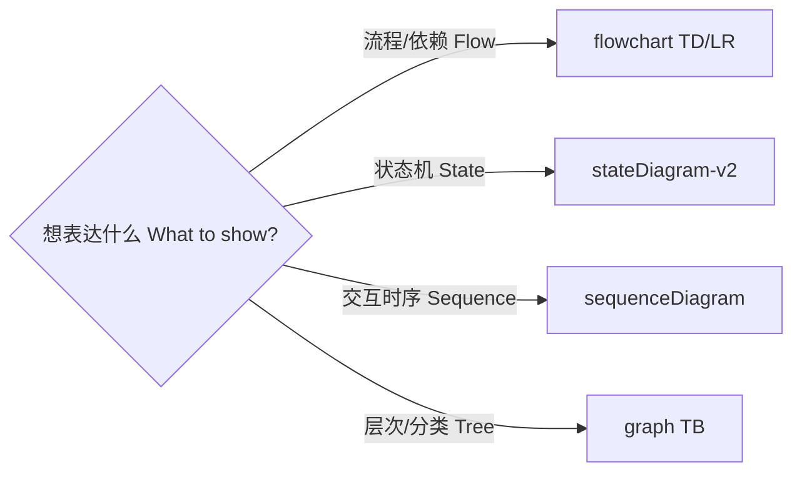

<!--
  file: docs/STYLE-GUIDE.md
  description: 文档风格指南 — 写作结构/Markdown 规范/Mermaid 可视化/徽章/语言细节
  author: YanYuCloudCube Team <admin@0379.email>
  version: v1.0.0
  created: 2026-09-16
  updated: 2026-09-16
  status: active
  tags: [docs,style,writing,diagram]
-->

# 文档风格指南 | Documentation Style Guide

> 全仓文档写作与可视化统一规范 Unified writing & visualization standard · 规范咨询 <docs@0379.email>
> 视觉令牌与图表契约见 [`visualization-spec.md`](visualization-spec.md) §4 / §5

---

## 一、语言规范 | Language Rules

1. **双语标题**：章节标题采用 `中文 | English` 形式（治理类文档强制；技术实现类文档中文为主）。
   Governance docs use bilingual headings `中文 | English`; technical docs may stay Chinese-first.
2. **保持英文的元素**：代码、命令、标签名、徽章、Mermaid 节点内文本、文件路径、元数据字段。
   Always English: code, commands, labels, badges, Mermaid node text, paths, metadata fields.
3. **术语表 Terminology**：

| 中文 | English | 备注 Notes |
| --- | --- | --- |
| 多文件编辑 | Multi-file editing | `FileStore` + `EditorTabs` |
| 面板宿主 | Panel host | 布局树 / DnD / 浮动窗口 |
| 快照 | Snapshot | Myers Diff 实现 |
| 上下文工程 | Context engineering | `llm/` 压缩与摘要 |
| 沙箱终端 | Sandboxed terminal | 策略闸门 + 审计 |
| 五高五标五化 | Five-High / Five-Standard / Five-Transformation | YYC³ 方法论 |

---

## 二、Markdown 结构规范 | Structure Rules

```markdown
<!--
  file: 相对路径/文件名.md
  description: 一句话说明
  author: YanYuCloudCube Team <admin@0379.email>
  version: v1.0.0
  created: YYYY-MM-DD
  updated: YYYY-MM-DD
  status: active | dev | deprecated
  tags: [tag1,tag2]
-->

# 唯一 H1（不含重复文件名）

> 版本 · 日期 · 维护者 / 关键链接

## 一、章节（中文序号 H2）
### 1.1 子节（数字 H3）

正文段落 < 120 字
```

| 规则 Rule | 说明 Detail |
| --- | --- |
| 唯一 H1 | 每篇仅一个 H1；不使用跳级（H2 → H4） |
| 元数据 | 新文档必须在文件头声明元数据注释块，字段顺序与 `README.md` 一致 |
| 命名 | `docs/` 使用 kebab-case（`developer-guide.md`）；模块说明固定 `README.md` |
| 链接 | 站内一律相对路径，禁止裸 URL；提交前确认无死链 |
| 表格 | 首列宽度适度，双语用两列（中文 / English）而非同格堆叠 |
| 收尾 | 页脚版权行：`**© 2025-2026 YanYuCloudCube™** · YYC³ Family IDE Matrix` |

---

## 三、可视化规范 | Visualization Conventions

### 3.1 图类型选择 | Diagram Type Picker



### 3.2 配色令牌 | Color Tokens

Mermaid 图内语义色（与 [`visualization-spec.md`](visualization-spec.md) §4 语义色板对应）：

| 语义 Semantics | Mermaid 写法 | 十六进制 Hex |
| --- | --- | --- |
| 成功 / 通过 success | `fill:#dfd,stroke:#0a0` | `#dfd` / `#0a0` |
| 失败 / 告警 failure | `fill:#fee,stroke:#c00` | `#fee` / `#c00` |
| 强调 / 决策 emphasis | 默认主题色 default theme | `#06b6d4`（primary.500） |

**禁止**：在组件代码内写死渐变或语义色 —— 一律取 [`visualization-spec.md`](visualization-spec.md) §4 的 Design Tokens。

### 3.3 节点命名 | Node Naming

- 节点文本格式：`图标 + 英文名 + 关键参数`（如 `🧪 Test & Coverage · 2 OS × 3 Node`）
- 分支标签使用小写英文：`pass` / `fail` / `yes` / `no`
- 单图节点 ≤ 15 个，超出则拆分为 `subgraph` 分层

### 3.4 代码块规范 | Code Block Rules

- 标注语言键（`bash` / `ts` / `tsx` / `json` / `yml` / `text`）
- 命令块加中文注释说明用途；示例应可直接复制运行，禁止伪代码充当示例
- 前端示例遵循项目约定：`@/` 别名导入、`barrel` 出口、文件名标头

---

## 四、徽章规范 | Badge Rules

- 徽章置于 README 顶部居中容器 `<div align="center">`
- 分组顺序：**工程状态**（CI / CodeQL / Tests / tsc / Audit / License）→ **技术栈**
- 统一 `flat-square` 风格；主题色取 Cyberpunk 令牌（`06b6d4` / `3b82f6` / `10b981`）
- **禁止装饰性死徽章**：每个徽章必须有真实数据源（Actions / shields.io 动态端点 / `package.json`）

---

## 五、语言细节 | Language Details

- 中英文之间加空格：`YYC³ 智能工作台` / `pnpm 9.0.0`
- 标点：中文语境用全角，代码 / 标签 / 路径语境用半角
- 数字与单位：`1056 用例` / `253KB gzip` / `P99 < 80ms`
- 路径写法统一为仓库相对路径（`ide/services/mcp/MCPClient.ts`），不用绝对路径
- 避免绝对化表述（「必然」「永远不会」）；性能预测给区间与前提条件

---

<div align="center">

**© 2025-2026 YanYuCloudCube™** · YYC³ Family IDE Matrix

</div>
